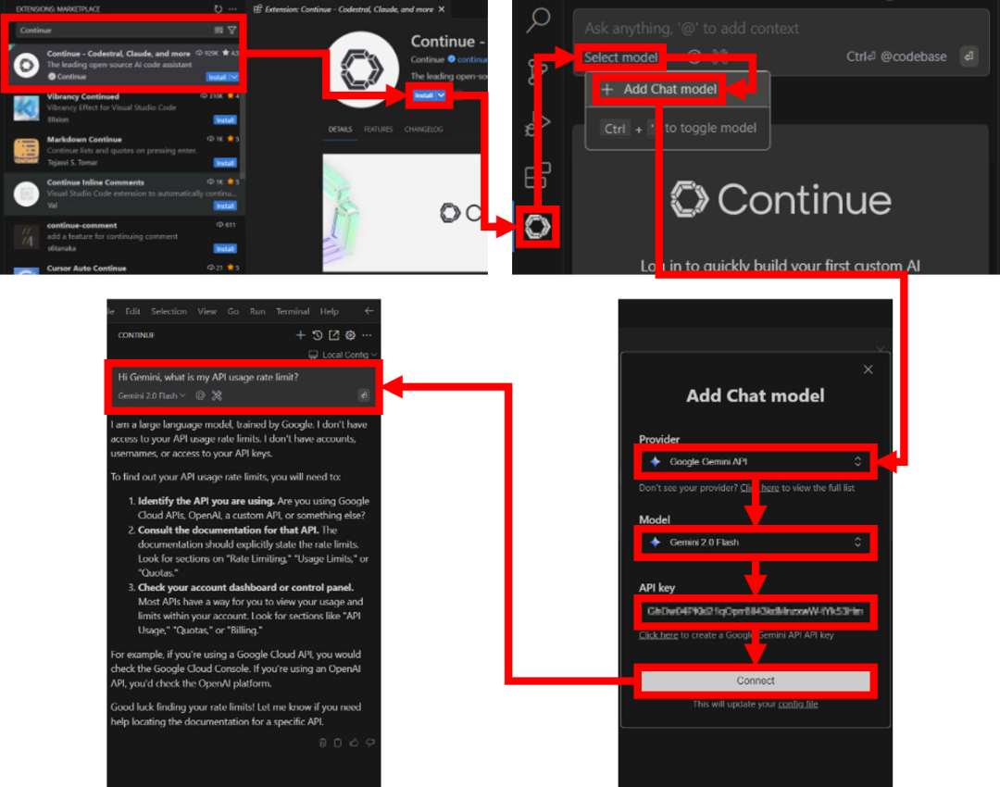
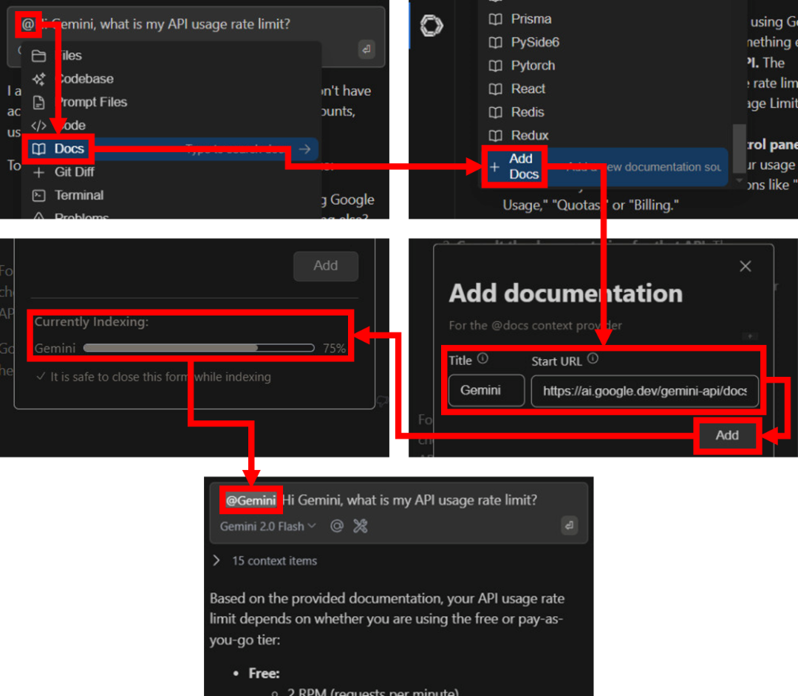

# [atet](https://github.com/atet) / [**_copilot_**](https://github.com/atet/copilot/blob/main/README.md#atet--copilot)

[](#nolink)

# Artificial Intelligence Copilot to Help You Code

Setup and some basic examples to get you started in <u><b>less than 10 minutes</b></u>; *programming will never be the same for you after this!*

In this short tutorial, you will:
- Sign up for Google Gemini AI access
- Setup Visual Studio Code (a.k.a. VSCode)
- Download and setup the AI copilot with Gemini in VSCode
- Perform five quick examples to demonstrate the power of this technology

Note that I developed this tutorial on Windows 10; Windows 11 and MacOS should be very similar steps.

## Google Gemini Access

> If you have your own locally hosted models, you can skip steps #1-4 and on step #12, see [Next Steps](#conclusion-and-next-steps) for instructions

You have to get programmatic (i.e., API) access to use Google Gemini outside of their web-based, chat offering.

1. Go to Google AI Studio and sign in with your Google account at https://aistudio.google.com/welcome
2. After signing in, click on "Get API key"
3. It may take up to 30 seonds to generate an API key, copy the key down for a later step, **do not share your API key**

[](#nolink)

## Visual Studio Code Setup

You can use VSCode without installing it by just downloading the "portable" `*.zip` version.

4. Download the `*.zip` version here: https://code.visualstudio.com/download
5. Extract the file, may take a few minutes
6. Within the extracted directory, add a new folder named "`data`"
7. Click on `Code.exe` to start up VSCode
8. Once VSCode is running, click on the Extensions tab in the left side menu (or use keyboard shortcut `CTRL+SHIFT+X`)

[](#nolink)

## AI Copilot Setup

We will use the Continue extension to leverage Google Gemini to help us code within VSCode.

9. Search for "Conitue" in the Extensions search bar
10. Install the Continue extension from continue.dev
11. Once it's done installing, click on the Continue icon in the left side menu
12. Click on "Select Model" and then "Add Chat Model"
13. This will open a window that will allow you to select Gemini (see [Next Steps](#conclusion-and-next-steps) for local models):
   - Provider: "Google Gemini API"
   - Model: "Gemini 2 Flash"
   - API key: "`<ENTER YOUR API KEY FROM STEP #3>`"
14. Click on Connect and now you can ask questions like, "*Hi Gemini, what is my API usage rate limit?*" (Note that your results will likely be different than mine)

[](#nolink)

## Additional Data for Specific Context

It looks like Gemini's general knowledgebase doesn't have specific information about its own API rate limits! So let's add a data source that will help out.

15. Type an ampersand ("`@`") and click on Docs in the menu that pops up
16. Scroll to the bottom of the Docs list and choose "+ Add Docs"
17. In the window that pops up, let's add a web link to Google's documentation on Gemini API limits:
   - Title: "Gemini"
   - Start URL: "https://ai.google.dev/gemini-api/docs/rate-limits"
18. When you click add, Continue will upload the information from the URL you entered, depending on the amount of data, **this can take >5 minutes to finish indexing**; you can come back to this later and see that asking the same question again with the `@Gemini` tag will result in a much better answer

[](#nolink)

## Programming with an AI Copilot

19. Close any tabs in the main body to the right, right-click and select "New Text File" (or CTRL+N)
20. Copy and paste the following incomplete Python function into the new text file:

```python
def add(x, y):
    # DO SOMETHING

add(1, 1) # Should print "2"
```

21. Highlight what you just pasted in the text file and right click on it, you'll see a menu option for "Continue" and "Fix this Code"
22. When you click on "Fix this Code," after a few moments, you'll see that Gemini basically filled in the incomplete function for you!
23. Go ahead and click on "Accept" with any changes Gemini suggests (Note that your results will likely be different than mine)

[](#nolink)

## Documentation and More with an AI Copilot

If your results are similar to mine, Gemini got rid of all the comments I had; let's see about Gemini automatically adding comments back for us.

24. Highlight the new code, right click, select "Continue" → "Write Comments for this Code" 
25. You can accept what Gemini documented for you or reject and try again for a slightly different result
26. Highlight the code again and select "Continue" → "Add Highlighted Code to Context" (or `CTRL+L`) to move the selected code into the chat window
17. Now you can have a discussion about the code and ask Gemini to do anything, like changing it (e.g., "*Change this function so that it subtracts instead*"), asking for a detailed explanation of what's going on, and even trying something like "*[ELI5](https://www.reddit.com/r/explainlikeimfive)*" for dense and complex code

[](#nolink)

## Conclusion and Next Steps

There you have it, your own personal AI assistant for programming and more. I hope that these past 10 minutes gave you an excellent impression of what's to come with this state-of-the-art technology and that you'll soon incorporate this into your workflow to achieve great things!

As far as next steps:
- *Continue* (😅) to work through code examples and chat with Gemini through VSCode, get comfortable with this new AI copilot experience
- The VSCode you just set up was not configured to execute any code, especially the simple Python code we had earlier; if you would like a live development environment, [click here to download Python for VSCode](https://code.visualstudio.com/docs/python/python-tutorial)
- If you have <u><b>your own locally-hosted large language models</b></u>:
   - Click on the chat window's model dropdown menu
   - Select the gear icon to the right of "Gemini 2.0 Flash"
   - In the `config.json` file that opens up, add information about your local model and save the file (must have OpenAI-compatible API like Llama.cpp, Ollama, and others)
   - Your local model will now be an option in the dropdown menu
   - [<u>Don't have a local model setup yet? Click here for my tutorial to easily set one up!</u>](https://github.com/atet/llm)

[](#nolink)

[Back to Top](#atet--copilot)

----------------------------------------------------------------------------

## Troubleshooting

Issue | Solution
--- | ---
**"Explain Like I'm 5"** | Large language models like Gemini will never get tired or annoyed that you have more questions; don't be afraid to continue to dive further into topics and have it explained in as many different ways as necessary to be understood
**"The models are starting to forget things from earlier in the conversation"** | These models have a limited amount of conversational memory (i.e., "context length") and can be worked around by starting a new conversation that is more focused on your topic of interest
**"The quality of the responses from my local model isn't as good as Gemini's"** | It is highly likely that Google's model is [better](https://artificialanalysis.ai/models/comparisons/gemini-2-0-flash-vs-llama-3-3-instruct-70b) than most free, open-source models that can be hosted on a home computer or even a professional workstation
**"It's not working!"** | This concise tutorial has distilled hours of sweat, tears, and troubleshooting; _it can't not work_

[Back to Top](#atet--copilot)

----------------------------------------------------------------------------

## Other Resources

**Description** | **URL Link**
--- | ---
Continue's 90-second feature trailer | https://youtu.be/V3Yq6w9QaxI
Atet's Local Large Language Model Tutorial | https://github.com/atet/llm 
Google Gemini Web-Based Functionality (this is different than programmatic API access) | https://gemini.google.com/app

[Back to Top](#atet--copilot)

----------------------------------------------------------------------------

<p align="center">Copyright © 2025-∞ Athit Kao, <a href="http://www.athitkao.com/tos.html" target="_blank">Terms and Conditions</a></p>